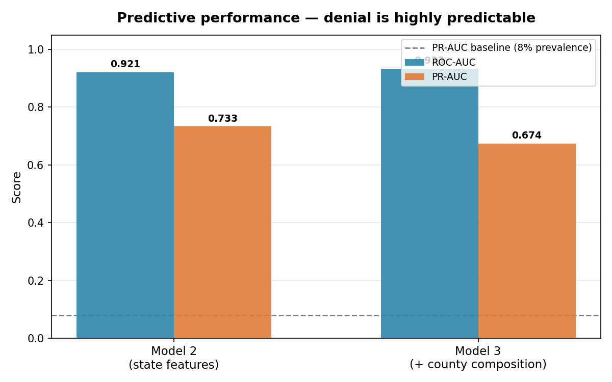
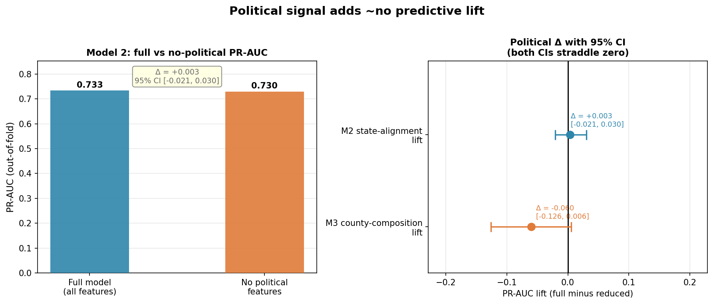
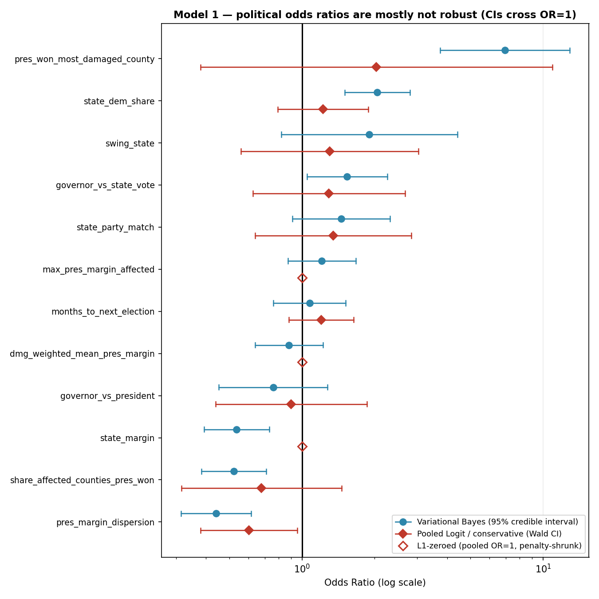
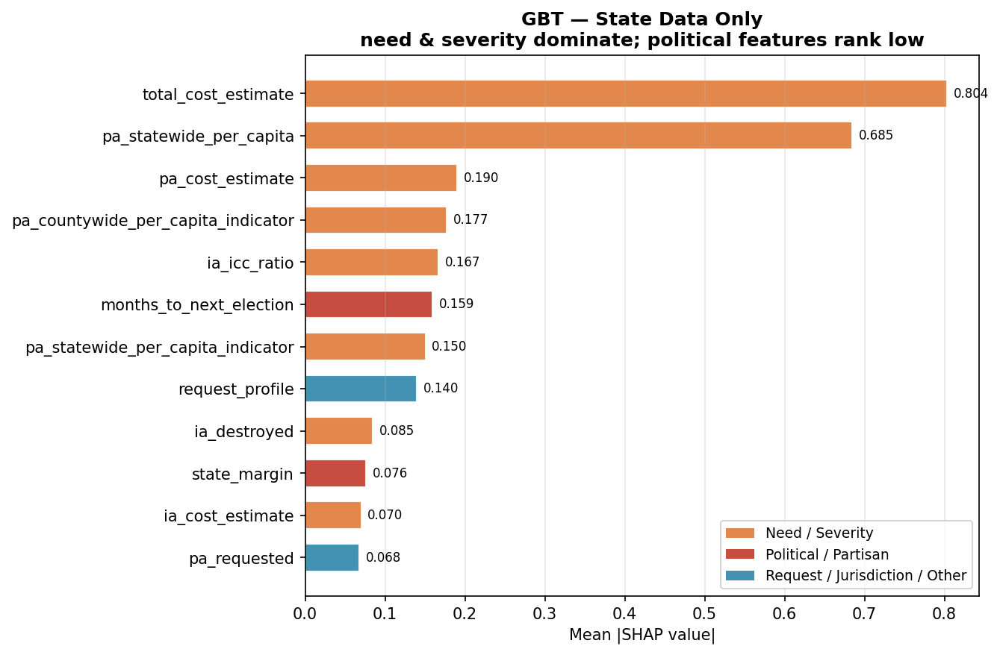
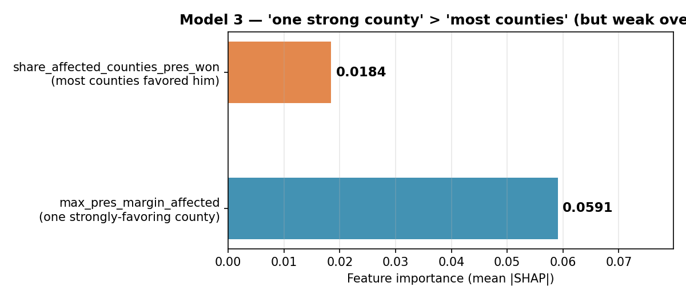

# PDA Decision Models — Summary

**What this is:** a high-level summary of the three machine-learning models built on `data/pda.db` to
test whether FEMA Preliminary Damage Assessment (PDA) declaration decisions can be predicted — and, in
particular, **how much political alignment with the sitting president influences the decision, net of
disaster need and severity.** Each section explains what the model does, why it was chosen, and the
pipeline that produces it. Charts of the key performance indicators and outcomes follow inline.

Full design rationale: `docs/superpowers/specs/2026-06-28-pda-decision-prediction-models-design.md`.
Reproduce everything with `scripts/run_all_models.py`; regenerate the charts with
`scripts/plot_model_results.py`.

---

## Overview

- **Data:** the full population of 1,378 FEMA PDA reports (2007–2026). The modeling set is the
  **1,279 initial decisions — 1,177 Declared vs. 102 Denied (~8% denial rate)**; the 99 appeal-stage
  denials are excluded so a denied-then-appealed disaster isn't counted twice.
- **Target:** a binary, request-level decision — *Declared* vs. initial *Denied*. Only request-time
  information is used; every post-decision field (e.g. `disaster_number`, `denial_reason`) is excluded
  as leakage.
- **Why three models:** they triangulate the same question from different angles and at different
  levels of credibility — an interpretable **effect size** (Model 1), a flexible **predictive**
  test (Model 2), and a sharper **county-level** political test (Model 3). A finding that holds across
  all three is far more defensible than any single model's result.

### The headline finding

**A PDA denial is highly predictable — but from disaster need and severity, not from politics.**

The models predict denial well (ROC-AUC ≈ 0.92–0.93), yet adding the political features buys
essentially nothing: the predictive lift from state partisan alignment is ~0, the lift from
county-level political composition is slightly negative, and Model 1's political odds ratios are not
robust once a conservative estimator is used. The raw "politically-aligned jurisdictions are denied
less" gap largely **does not survive controls for need**.

---

## Model 1 — Hierarchical logistic regression *(the effect size)*

**What it does.** An interpretable logistic regression that estimates the odds of denial as a function
of need, request, and political features, and reports a coefficient — an **odds ratio with a
confidence interval** — for each political variable *net of* the need controls. This is the model that
produces a quotable "politics shifts the odds of denial by X" number.

**Why not standard linear regression?** The outcome is *binary* (denied = 1, declared = 0), and that
single fact rules out ordinary least-squares (OLS) regression. If you fit a straight line to a 0/1
outcome — the so-called *linear probability model* — four things go wrong, and they are worth spelling
out because together they motivate the entire generalized-linear-model framework that logistic
regression belongs to:

1. **Predictions aren't bounded.** A line runs to ±∞, so it will cheerfully predict a denial
   "probability" of 1.3 or −0.2. Probabilities must lie in [0, 1]; a line cannot promise that.
2. **Constant marginal effects are implausible.** OLS forces every predictor to move the probability by
   the same amount everywhere. But nudging a near-certain approval from 2% to 4% denial risk is not the
   same as tipping a genuinely borderline 50/50 case — near the floor and ceiling, a given change in
   damage *should* matter less. A straight line cannot bend to allow that.
3. **The error structure breaks OLS's assumptions.** For a binary outcome the variance is tied to the
   mean (it equals p(1−p)), so the residuals are heteroskedastic and non-normal *by construction*. OLS
   standard errors, t-tests, and confidence intervals are therefore invalid — fatal here, since this is
   precisely the model whose job is to produce a trustworthy *effect size with uncertainty*.
4. **There's no natural effect measure.** We want to say "alignment multiplies the *odds* of denial by
   X." OLS only gives a change in raw probability, which is clumsy and — per point 2 — not even constant.

**Logistic regression** repairs all four by modeling the **log-odds** of denial as a linear function of
the predictors and passing that through the logistic (S-shaped) curve, which is bounded to (0, 1). Its
coefficients exponentiate into **odds ratios** — a clean effect size that is constant on the odds
scale — and it is fit by maximum likelihood with inference built for the binomial error structure. With
a rare outcome (~8% denials sitting near the 0 boundary) these are not cosmetic advantages: a linear
model is *especially* ill-behaved there.

**Why make it *hierarchical*?** A plain logistic regression treats all 1,163 state/DC reports as
independent, but they are not — many share a state and an administration, and party alignment is
*confounded* with both. If red states simply experience different disasters than blue states, a naive
model could credit "alignment" with what is really geography. Adding **random intercepts for state and
for year** — *partial pooling* — gives each state and year its own baseline denial level, so the
political coefficients are identified from variation *within* states and *within* years rather than
across them. This is the standard tool for clustered, multilevel data, and it is what licenses the claim
that the political estimate is "net of" stable regional and era differences. The model is fit only on
the **50 states + DC**, where partisan alignment is even defined; sovereign tribes and territories are
excluded from this estimand and handled separately.

**Pipeline (and why each step is there).**
1. **Assemble and restrict the sample** to states + DC, neutralizing DC's (nonexistent) gubernatorial
   alignment via an applicability flag. *Why:* the political question is only well-posed where a
   state-vs-president and governor-vs-president comparison actually exists; folding in jurisdictions for
   which it is undefined would smuggle a *jurisdiction-status* effect into the political coefficient.
2. **Handle missing data deliberately** — drop the ~84%-null IA-demographic block, and for
   moderately-null cost fields add a *missingness indicator* before imputing. *Why:* a regression cannot
   consume a blank cell, and naive imputation quietly pretends every missing value is average. The
   indicator instead lets the model learn whether "was this even reported?" carries signal.
3. **Standardize the continuous predictors** (to units of one standard deviation). *Why:* cost is in
   hundreds of millions while vote shares are fractions; on those raw scales the optimizer is
   numerically unstable and a coefficient's magnitude reflects its *units*, not its importance.
   Standardizing puts every continuous effect on a comparable "per-one-SD" footing and lets the fit
   converge.
4. **Fit the mixed-effects logit** (`BinomialBayesMixedGLM`, variational) with state + year random
   intercepts, and read off odds ratios with 95% intervals. *Why:* this is the step that delivers the
   headline effect sizes *with* their uncertainty.
5. **Cross-check against a conservative pooled logit.** *Why:* the fast variational fit is known to
   *underestimate* uncertainty, so its intervals look deceptively tight. A second, more conservative
   estimator is an honesty check on which "significant" effects actually survive — and here, almost none
   do.

**Outcome.** The political odds ratios are *suggestive but not robust*. The variational-Bayes intervals
look tight, but the conservative pooled cross-check widens them so that **almost every political
effect's interval crosses OR = 1** — only `pres_margin_dispersion` is bounded away from 1 under both
estimators. Governor alignment points the intuitive way (OR ≈ 0.76 — aligned governors denied less),
and "share of affected counties the president won" points toward stronghold favoritism (OR ≈ 0.52),
but neither survives the conservative check. (Estimand: 1,163 state/DC reports, 87 denials — a small
positive class that fundamentally limits power.)

---

## Model 2 — Gradient-boosted trees + ablation + SHAP *(predictability & lift)*

**What it does.** A flexible, nonlinear classifier (`HistGradientBoostingClassifier`) that answers two
questions about the *same* trained model: **(a) how well can denial be predicted at all**, and
**(b) how much does the political block contribute** — measured two complementary ways: an **ablation**
(train with vs. without the political features and compare held-out accuracy) and **SHAP** attribution
(how large is each feature's contribution).

**Why it was selected.** Where Model 1 is interpretable-but-linear, Model 2 is the *predictive*
workhorse. **Gradient-boosted trees** build an ensemble of many shallow decision trees, each trained to
correct the errors of the ones before it. Because a decision tree carves the data into regions, the
ensemble can represent *nonlinearities* (the effect of cost can flatten at the extremes) and
*interactions* (politics might matter *only* when damage is borderline) automatically — exactly the
structure a linear logit assumes away. Trees also absorb missing values natively (a blank is simply
routed down its own branch), which matters because several need fields are sparse. The cost of all this
flexibility is interpretability: a 300-tree ensemble is a black box, so we interrogate it two
complementary ways — an **ablation** and **SHAP** — described below.

**Pipeline (and why each step is there).**
1. **Slice to Model 2's feature set** — need/severity, request, election-timing, jurisdiction, and the
   **state-level** political block, deliberately *excluding* the county block. *Why:* leaving the county
   features out now makes their later addition in Model 3 a clean, controlled experiment.
2. **Ordinal-encode the categoricals and fit a class-weighted gradient booster.** *Why ordinal rather
   than one-hot:* trees split on numeric thresholds, so they only need each category mapped to a distinct
   integer; one-hot encoding would needlessly explode the feature space. *Why class-weighted:* with only
   ~8% denials, a model can score deceptively well by almost always guessing "declared." Up-weighting the
   rare class forces it to actually learn what distinguishes a denial.
3. **Evaluate with stratified, state-grouped cross-validation**, reporting PR-AUC alongside ROC-AUC.
   *Why group by state:* if the same state appeared in both the training and test folds, the model could
   memorize state-specific quirks and look better than it truly generalizes — grouping closes that
   leakage. *Why PR-AUC:* on a rare positive class, ROC-AUC can look excellent while the model is still
   poor at the thing we care about (catching denials); precision-recall AUC is the honest yardstick for
   imbalanced data.
4. **Ablation — the political-*lift* test.** Train the full model and a copy with the political block
   removed, then compare their out-of-fold PR-AUC with a **paired bootstrap** confidence interval on the
   difference. *Why:* this is an assumption-light way to ask "does politics add *predictive* value?" If
   the political features carried real signal, deleting them should hurt accuracy by a measurable,
   reliably-positive amount. The bootstrap converts a single difference into an interval, so we can
   distinguish a genuine gap from noise.
5. **SHAP — the *attribution* test.** Decompose each prediction into per-feature contributions and
   average their magnitudes. *Why:* the ablation tells us *whether* politics helps; SHAP tells us *how
   much each feature contributes, and where*, putting political features and need/severity features on a
   single comparable scale — the very thing a black-box ensemble otherwise hides.

**Outcome.** Denial is **highly predictable — ROC-AUC ≈ 0.92, PR-AUC ≈ 0.73** (vs. an 8% baseline) —
but the **state partisan-alignment block adds ~zero predictive lift: ΔPR-AUC = +0.003 (95% CI
−0.021…0.030)**, an interval centered on zero. SHAP tells the same story: the top features are all
need and severity (`total_cost_estimate`, `pa_statewide_per_capita`, cost and per-capita indicators);
the first partisan feature (`state_margin`) ranks ~10th. *(Note: the ablation precisely measures the
lift from state **partisan alignment**, holding election-timing and competitiveness fixed, since those
sit in both arms.)*

---

## Model 3 — County-composition block + M2→M3 ablation *(the sharpest political test)*

**What it does.** Reuses Model 2's engine but **adds a block of county-composition political features**
— aggregations over each disaster's affected counties that ask whether the president favors disasters
hitting his *strongholds*. Because the only difference from Model 2 is this block, **the M2→M3
comparison is itself the ablation** that isolates the incremental value of fine-grained county
political detail beyond state-level alignment.

**Why it was selected.** It dissociates *state* alignment from *local* alignment — a disaster can hit
deep-red counties inside a blue state — and it separates two distinct sub-hypotheses: "**one** county
heavily favored the president" (max county margin) vs. "**most** counties favored him" (share of
counties won). This is the most specific test of political favoritism in the data.

**Pipeline (and why each step is there).**
1. **Engineer per-disaster county aggregates** from `report_counties` — share of affected counties the
   president won, his maximum margin among them, the damage-weighted mean margin, the dispersion, and so
   on. *Why summarize:* a disaster spans many counties, but the model needs exactly one row per
   disaster, so the county-level vote pattern must be condensed into features. The choice of summaries is
   deliberate: "max margin" and "share won" encode the *two competing hypotheses* — **one** stronghold
   county vs. **most** counties favoring him — so the model can tell them apart instead of blurring them
   into a single average.
2. **Build Model 3's feature set as a strict superset:** Model 2's features **plus** the county block.
   *Why a superset and nothing else:* if Model 3 differs from Model 2 by *only* the county block, then any
   change in performance is attributable to that block alone — the logic of a controlled experiment.
3. **Run the identical engine on the identical rows and cross-validation folds as Model 2**, then compare
   M2 vs. M3 out-of-fold PR-AUC with a paired bootstrap CI. *Why hold everything fixed:* freezing the
   model, the rows, and the fold splits makes the M2→M3 difference a *paired* comparison, which isolates
   the incremental value of county detail free of confounding from a different sample or a different
   random split. (This is the same ablation logic as Model 2, applied one level deeper.)
4. **Compare the SHAP importance of "one strong county" vs. "most counties."** *Why:* even when a feature
   block adds no net predictive value, asking *which* feature inside it the model leaned on reveals which
   version of the stronghold hypothesis the data tilts toward — here, faintly, "one strong county."

**Outcome.** Fine-grained county political composition **adds no predictive value** — going from M2 to
M3 *lowers* PR-AUC (0.733 → 0.674; **county lift ΔPR-AUC = −0.060, 95% CI −0.126…0.006**), the classic
signature of adding noise rather than signal. Within the (weak) county signal, "**one strongly-favoring
county**" outweighs "**most counties favored him**" by ~3× (`max_pres_margin_affected` ≈ 0.059 vs.
`share_affected_counties_pres_won` ≈ 0.018) — but against a negative overall lift, even that is faint.

---

## Cross-model conclusion

| Model | Question | Result |
| --- | --- | --- |
| **M1** — hierarchical logit | How large is the political effect, net of need? | Suggestive but **not robust** — conservative CIs cross OR=1 for nearly all political features |
| **M2** — gradient boosting | Does state partisan alignment improve prediction? | **No** — ΔPR-AUC ≈ 0 (CI spans zero); need/severity dominate |
| **M3** — + county composition | Does local stronghold composition help? | **No** — county lift is negative; "one strong county" > "most counties" but weak |

Across three methods and two levels of analysis, the conclusion is consistent: **political alignment
has little *robust* effect on the PDA decision once disaster need and severity are accounted for.**
Decisions are well-explained by cost and per-capita impact, not by who the requesting state or county
voted for. The raw association (aligned jurisdictions denied less) is real in the unadjusted data but
largely dissolves under controls.

**Caveats (why this is a careful "little robust effect," not a hard "zero").**
- **Low power:** only ~87–102 denials, so confidence intervals are wide and a modest true effect could
  go undetected.
- **Conservative-vs-optimistic inference:** Model 1's variational intervals are anti-conservative; the
  pooled cross-check is the honest read and it is the one that erases significance.
- **Data limits:** the IA-demographic (vulnerability) block is ~84% null, so community-vulnerability
  controls are weak; effects are measured "net of *observed* need," not strict causation.
- **Scope:** sovereign tribes and territories are handled as a separate jurisdiction class (and excluded
  from Model 1's political estimand), because partisan alignment is undefined for them — tribes' notably
  higher denial rate is a *jurisdiction-status* effect, not a partisan one.
- **Reporting nuances:** SHAP importances are computed on the full corpus (N ≈ 1,279) while the
  ablations run on N ≈ 1,236 (rows lacking a state grouping key are dropped from grouped CV); the
  bootstrap resamples rows i.i.d. though CV is grouped by state.

---

*Charts generated by `scripts/plot_model_results.py` from `data/pda.db`; deterministic (`random_state=0`).*
